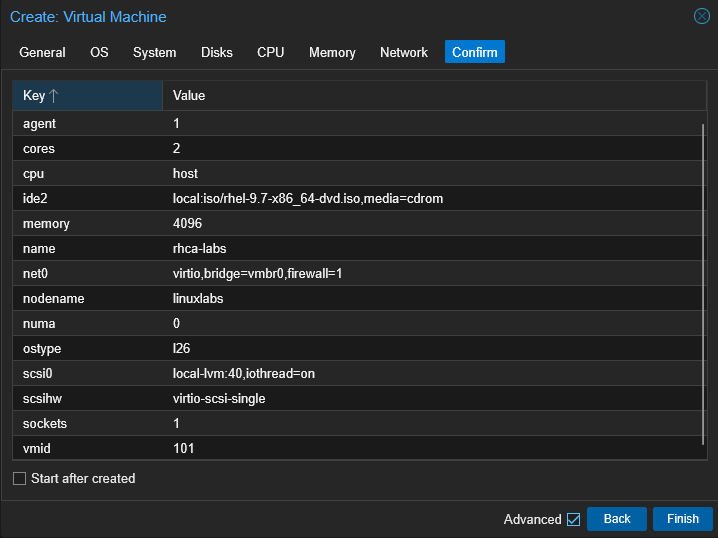
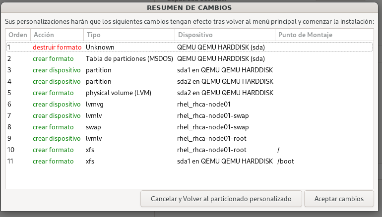
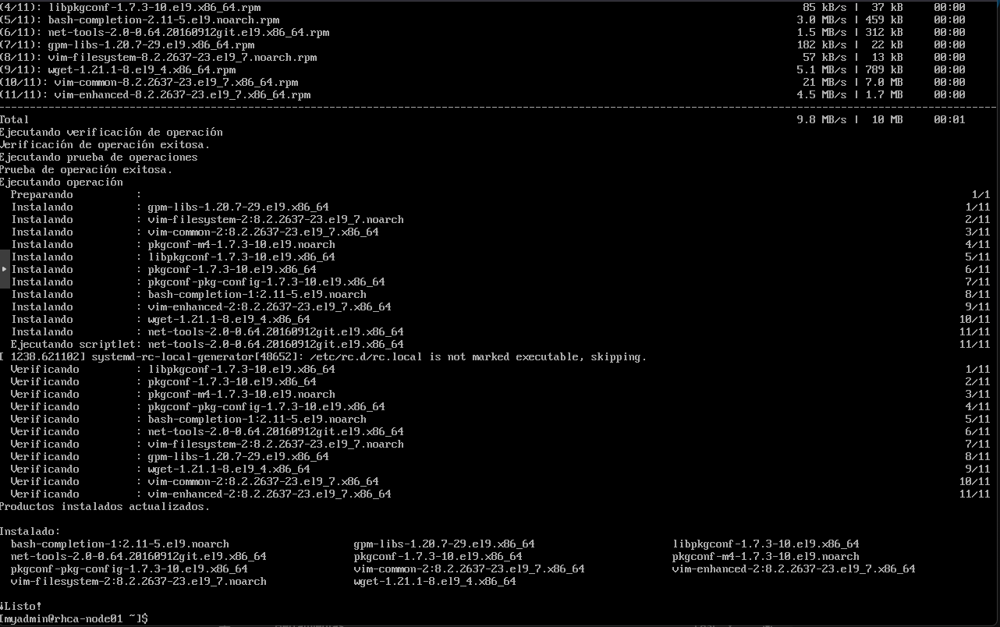
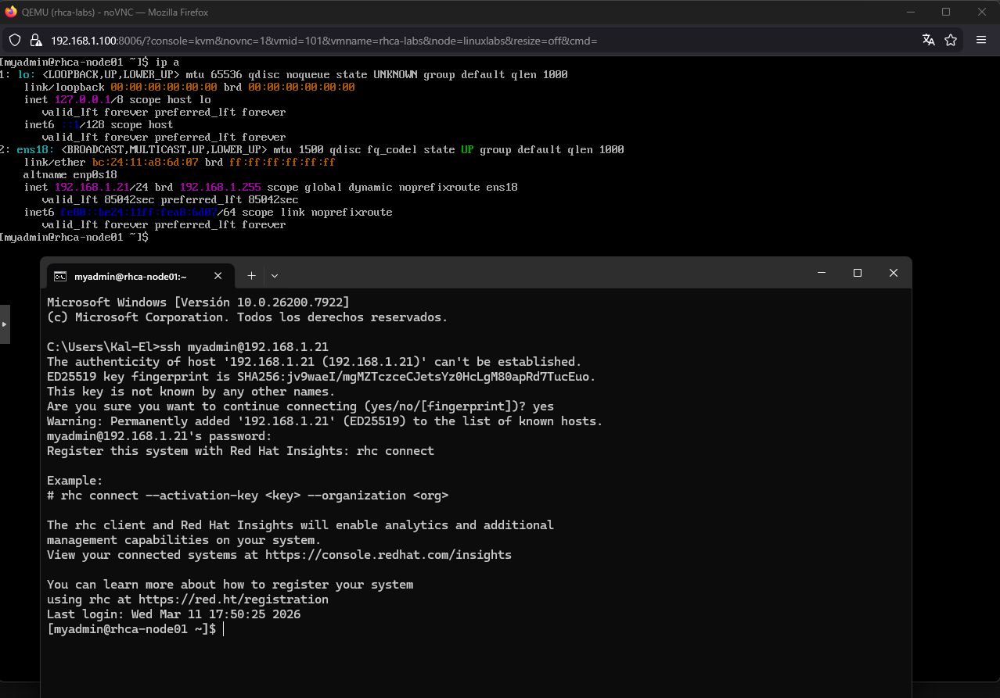

# 🐧 Lab 01: Instalación y Configuración Base de RHEL 9.7

Este manual documenta el proceso detallado de instalación, configuración inicial y preparación del entorno de laboratorio para la certificación **RHCSA**.

## 🏗️ Entorno del Laboratorio
El despliegue se realiza sobre un nodo de virtualización **Proxmox VE 9.0.3** ejecutándose en un hardware **BMAX Pro** con 32GB de RAM y 1TB de disco duro.

### Especificaciones de la VM (rhca-labs)
* **CPU**: 1 Socket / 2 Cores (Tipo: Host para acceso real al microprocesador).
* **RAM**: 4GB (4096MB).
* **Disco**: 40GB (VirtIO).
* **Sistema**: Qemu Agent habilitado para gestión desde el hipervisor.
[Enter]

 <br>
*Configuración detallada de la VM incluyendo Qemu Agent y tipo de CPU Host.*

---

## 💾 Gestión de Almacenamiento (LVM)
Se aplica un particionado manual basado en **Logical Volume Management (LVM)** para garantizar flexibilidad en la gestión de volúmenes.

| Punto de Montaje | Tamaño | Tipo / Volume Group | Sistema de Archivos |
| :--- | :--- | :--- | :--- |
| `/boot` | 1024 MiB | Partición Estándar | XFS |
| `swap` | 2 GiB | LV en `rhel_rhca-node01` | swap |
| `/` | 37 GiB | LV en `rhel_rhca-node01` | XFS |

[Enter]

 <br>
*Esquema final de volúmenes lógicos antes de comenzar la instalación.*

---

## ⚙️ Configuración del Sistema

### 1. Selección de Software
Se ha optado por una **"Minimal Install"**.<br>
Esta selección instala únicamente lo estrictamente necesario, optimizando el rendimiento y centrando el aprendizaje en la administración por línea de comandos.
[Enter]


[Enter]

### 2. Registro y Actualización
El sistema debe estar registrado en el portal de Red Hat para acceder a los repositorios oficiales y parches de seguridad.
[Enter]

<br>
*Verificación de conectividad desde Windows PowerShell hacia el nodo RHEL.*
[Enter]

```bash
# Registro del sistema
sudo subscription-manager register
sudo subscription-manager attach --auto

# Actualización completa de paquetes
sudo dnf update -y
```

### 3. Herramientas de Administración
Instalación del kit básico de supervivencia para el administrador:

* **`vim`**: Editor de archivos de configuración (equivalente a nano).
* **`bash-completion`**: Permite completar comandos automáticamente pulsando la tecla **Tab**.
* **`net-tools`**: Incluye utilidades clásicas de red como `ifconfig` o `netstat`.
* **`wget` / `curl`**: Herramientas imprescindibles para la descarga de recursos y archivos directamente desde la web al servidor.

## 🌐 Configuración de Red Estática
Para asegurar la accesibilidad permanente del servidor en el laboratorio, se configura un direccionamiento estático mediante la herramienta nmcli.

```bash
# Definición de IP, Máscara y Puerta de Enlace
sudo nmcli con mod ens18 ipv4.addresses 192.168.1.21/24 ipv4.gateway 192.168.1.1

# Configuración de Servidores DNS (Google y Cloudflare)
sudo nmcli con mod ens18 ipv4.dns "8.8.8.8,1.1.1.1"

# Cambio de modo DHCP a Manual y aplicación de cambios
sudo nmcli con mod ens18 ipv4.method manual
sudo nmcli con up ens18
```
